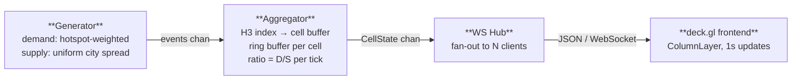

# Surgemap


Real-time supply/demand pricing heatmap engine for spatially distributed marketplaces: ride-hailing, food delivery, courier services, or any platform where demand and supply cluster geographically.

Synthetic events flow through a Go aggregation pipeline, get bucketed into H3 hexagonal cells, and stream over WebSocket to a 3D deck.gl map, updating every second.

## Stack

| Layer | Technology |
|---|---|
| Backend | Go, gorilla/websocket |
| Spatial indexing | uber/h3-go (H3 resolution 7) |
| Transport | WebSocket push |
| Frontend | React, deck.gl ColumnLayer |
| Base map | MapLibre GL (no API token required) |

## Running locally

```bash
make dev
# ws listens on :8080, H3_RESOLUTION=7, window=30s, frontend hosted on :5173

make up
# docker deployment
```

Environment variables:

| Variable | Default | Description |
|---|---|---|
| `PORT` | `8080` | Backend port |
| `H3_RESOLUTION` | `7` | H3 cell resolution (7–9) |
| `WINDOW_SECONDS` | `30` | Sliding window duration |
| `DEMAND_RATE` | `8.0` | Synthetic demand events/sec |
| `SUPPLY_RATE` | `5.0` | Synthetic supply events/sec |

## Architecture



### Generator

Two goroutines emit synthetic events at configurable rates:

- **Demand**: Gaussian-distributed around Amsterdam hotspots (Centraal Station, Leidseplein, Schiphol, Zuidas, Rembrandtplein). Weighted by area activity level.
- **Supply**: Uniform across the city bounding box. Intentionally lower rate in hotspot areas, producing observable surge zones.

### Aggregator

Each event is indexed into an H3 cell via `h3.LatLngToCell`. A per-cell ring buffer holds timestamped events within the configured window. Every second:

1. Prune events older than window
2. Compute `ratio = demand / supply` per cell
3. Map ratio to surge modifier via pluggable `SurgeAlgorithm` interface
4. Emit `[]CellState` snapshot

The `SurgeAlgorithm` interface is intentionally swappable.

`LinearSurge` is the default, replaceable with an ML-based scorer without touching aggregator logic.

### WebSocket Hub

JSON payload is marshaled once per tick and fanned out to all connected clients. 

Slow clients get frames dropped rather than blocking the broadcast loop. 

Chose WebSocket over SSE for the bidirectional upgrade path, future versions can accept viewport bounds from clients to filter which cells are sent.

## Tradeoffs

### H3 Resolution: 7 vs 9

| | Resolution 7 | Resolution 9 |
|---|---|---|
| Avg cell area | ~5.16 km² | ~0.1 km² |
| Edge length | ~1.2 km | ~174 m |
| Active cells (Amsterdam) | ~60 | ~3,000 |
| Events for stable ratio | ~10 / window | ~500 / window |

Resolution 7 is correct for this synthetic load (8 events/sec citywide). At resolution 9, most cells see 0–1 events per window, ratios are statistically meaningless. Resolution 9 requires production-scale event volumes (thousands/sec) to be useful.

### Window Size

| Window | Reactivity | Noise | Outcome |
|---|---|---|---|
| 10s | Very fast | High | single burst spikes ratio |
| 30s | Fast | Moderate | **default** |
| 5min | Slow | Low | misses short demand spikes |

EMA (exponential moving average) was considered as an alternative to a hard window. 

It smooths better, but loses the absolute count semantic: "3 requests, 0 drivers" is operationally meaningful; an EMA score is not.

### Push vs Poll

Aggregation runs once per second on the server, producing one shared snapshot. 

HTTP polling would either re-aggregate per request or require a cache layer. 

WebSocket pushes the pre-computed result to N clients in one pass.

### Sharding at Scale

Production load (millions of events/min, thousands of WebSocket clients):

1. Shard aggregators by H3 resolution-5 parent cell (~250 km² per shard, ~20 shards per major city)
2. Consistent hashing on cell index for shard assignment; virtual nodes for rebalance
3. Aggregator shards publish to Kafka (one topic per shard, partitioned by H3 index)
4. WebSocket hub tier subscribes to relevant topics, filters by connected client viewport
5. Ring buffers move to Redis sorted sets, aggregator shards become stateless, horizontally scalable

```
Events → Kafka (partitioned by H3 parent) → Aggregator shards → Redis sorted sets
                                                                        │
WS clients ← Hub tier (viewport filter) ←── pub/sub subscription ──────┘
```

## License

MIT
